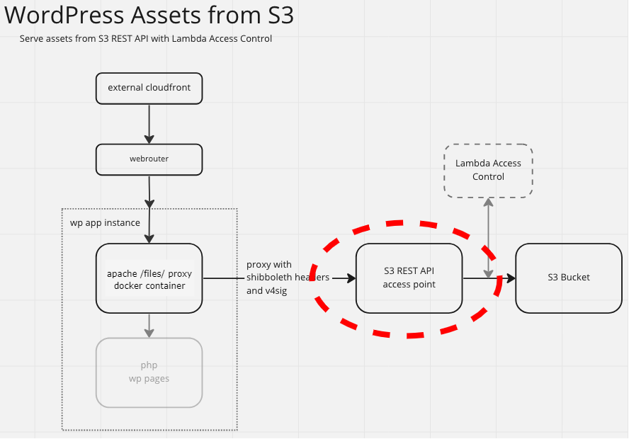

# Wordpress to cloud object lambda modelling

### Overview:

This is a demo project to prototype an approach for the proxying of s3 content acquisition for http requests, as part of the BU Wordpress to AWS Cloud project

This is done through [Object Lambda](https://docs.aws.amazon.com/AmazonS3/latest/userguide/transforming-objects.html) and [Access Points](https://docs.aws.amazon.com/AmazonS3/latest/userguide/access-points.html), using the [Serverless Application Model](https://docs.aws.amazon.com/serverless-application-model/latest/developerguide/what-is-sam.html) *(SAM)*
The AWS reference that is most closely followed is: [Working with GetObject requests in Lambda](https://docs.aws.amazon.com/AmazonS3/latest/userguide/olap-writing-lambda.html). 

### Context:

This approach applies to the overall project as diagrammed below in the section highlighted in red.
This demo does not include the external cloudfront and webrouter - your browser makes requests directly to the ec2 instance.




### Prerequisites:

- [Install the SAM CLI](https://docs.aws.amazon.com/serverless-application-model/latest/developerguide/install-sam-cli.html)
- AWS IAM role with admin privileges
- [Visual studio code](https://code.visualstudio.com/download)

### Building:

##### Preparatory steps:

1. Before you run any SAM commands, you will need to prepare the files needed for when [lambda layer](https://docs.aws.amazon.com/lambda/latest/dg/configuration-layers.html) creation is triggered as part of the upcoming stack creation during the SAM deploy/sync executions. These files include the node_modules directory produced by npm in a location where the [`AWS::Serverless::LayerVersion`](https://docs.aws.amazon.com/serverless-application-model/latest/developerguide/sam-resource-layerversion.html) expects to find them as per convention.

   ```
   # From the root directory
   cp package.json dependencies/nodejs/
   cd dependencies/nodejs
   npm install -y
   ```

2. Before running any commands, set your profile against the environment first:

   ```
   export AWS_PROFILE=[your profile]
   ```

##### Running commands:

Now you can run the SAM commands *(validate, package, deploy, delete)* by themselves, or make use of some shortcut script (run.sh) that:

- Offers parameters that allow for default naming and value settings that are either not available for samconfig.toml files, or whose combination possibilities are too numerous to be efficiently represented through --config-env settings.
- Allows for dryrun option to view resolved commands without execution.
- Auto-populates the assets bucket with content upon creation and empties it so it can be deleted along with other resources made during stack creation.

*<u>IMPORTANT NOTE</u>: If yours is going to be the only instance of this stack in the account, then you'd probably want the default naming convention.*
*If so, you simply omit the "landscape" parameter. You specify a landscape parameter to create a distinct naming convention for the stack and many of the resources that it creates (ie: "landscape=dev"). The examples below assume the default and omit the landscape parameter*.

There are multiple options available:

1. Most basic: Build, package and deploy the app (runs both a sam build and deploy):

   ```
   sh run.sh task=deploy
   ```

2. The lambda will assume a default HOST_NAME environment variable of "local-ol", but you can override this:

   ```
   sh run.sh task=deploy host_name=my.custom.hostname
   ```

3. If you want the lambda function to include authorization logic (shibboleth header analysis), indicate as follows

   ```
   sh run.sh task=deploy shib=true host_name=[my.cn.known.by.the.idp]
   ```

4. If you want also to create a user that has access to the bucket and all its access points:

   ```
   sh run.sh task=deploy bucket_user=true
   ```

5. If you want to also create an ec2 instance that runs a demo website that displays s3 content via this olap:
   *NOTE: This will implicitly create the user as well.*

   ```
   sh run.sh task=deploy ec2=true
   ```

6. Combined example: creates ec2, user, and requires shib auth:

   ```
   sh run.sh task=deploy ec2=true shib=true host_name=[my.cn.known.by.the.idp]
   ```

7. Create only the s3 bucket and bucket user, with no lambda, access points, or ec2 instance:

   ```
   sh run.sh task=deploy bucket_user=true olap=false
   ```

8. Delete the app along with ALL created resources (except the code bucket):

   ```
   sh run.sh task=delete
   ```

### Usage & Notes:

- **host_name:**
  The `host_name` variable does not really make any difference in how any resources in the stack operate save for one small object lambda function adjustment to a specific s3 asset before it writes it out as a response. This file, index.htm, has image urls that are dynamically adjusted to reflect `host_name`.

- **shib:**
  If `shib=true`,

  - `ec2=false` *(default)*
    This implies that you are running a client on localhost, that includes a shibboleth SP, which is accessing the stack access points for assets. This also means that you need to add an entry to your hosts file so that any redirects that the shibboleth IDP sends to your browser, get properly routed to localhost.

  - `ec2=true`
    You may be intending to route communications through a BU common name like: `*.kualitest.research.bu.edu`.
    In this case, you need to "piggy-back" on an existing Route53 hosted zone to ensure that redirects get routed back to the ec2 instance.
    Simply select a subdomain that is free - like **`"dev"`** and set `host_name` accordingly: "**`dev`**`.kualitest.research.bu.edu`"
    The apache hosted site on the ec2 instance only "listens" against that common name for the s3 asset requests.
    Thus, for traffic to be routed to the ec2 instance with that CN, an A record needs to be added into the hosted zone for kualitest:

    - Record Name: [`host_name`]

    - Type: A

    - Routing Policy: Simple

    - Value/Route traffic to: [Public IP address of the ec2 instance]

- You have a number of API methods for retrieving assets from the bucket:

  1. **Supporting access point:**

     ```
     aws s3api get-object --debug --key dilbert1.gif --bucket arn:aws:s3:us-east-1:770203350335:accesspoint/bu-wp-assets-olap-dev-ap dilbert1.gif
     ```

  2. **Object lambda access point (olap):**

     ```
     aws s3api get-object --debug --key dilbert1.gif --bucket arn:aws:s3-object-lambda:us-east-1:770203350335:accesspoint/bu-wp-assets-olap-olap dilbert1.gif
     ```

  3. **Demo web page:**
     When you deploy the stack, one of the outputs you will see is called `"HostName"`.
     If you navigate with your browser to `https://${HostName}/index.htm`, you should see S3-originated content displayed.
     Each image that you see on the page is acquired through an access point.

  4. **Curl:**
     In order to get objects from the olap using curl, you will have to sign the request yourself.
     This is documented in the [companion git repository](https://github.com/whennemuth/bu-wp-assets-olap-client/blob/master/baseline/signer.md).

