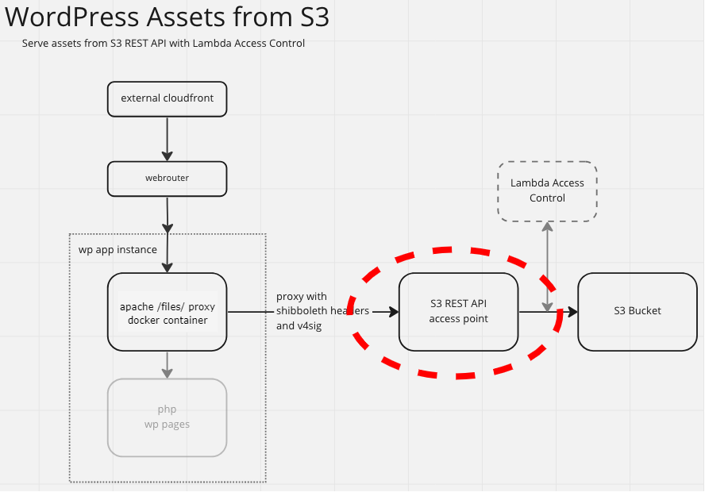

# Wordpress to cloud object lambda modelling

### Overview:

This is a demo project to prototype an approach for the proxying of s3 content acquisition for http requests, as part of the BU Wordpress to AWS Cloud project

This is done through [Object Lambda](https://docs.aws.amazon.com/AmazonS3/latest/userguide/transforming-objects.html) and [Access Points](https://docs.aws.amazon.com/AmazonS3/latest/userguide/access-points.html), using the [Serverless Application Model](https://docs.aws.amazon.com/serverless-application-model/latest/developerguide/what-is-sam.html) *(SAM)*
The AWS reference that is most closely followed is: [Working with GetObject requests in Lambda](https://docs.aws.amazon.com/AmazonS3/latest/userguide/olap-writing-lambda.html). 

### Context:

This approach applies to the overall project as diagrammed below in the section highlighted in red.
This demo does not include the external cloudfront and webrouter - your browser makes requests directly to the ec2 instance.




### Prerequisites:

- [Install the SAM CLI](https://docs.aws.amazon.com/serverless-application-model/latest/developerguide/install-sam-cli.html)
- AWS IAM role with admin privileges
- [Visual studio code](https://code.visualstudio.com/download)

### Usage:

You can run the SAM commands *(validate, package, deploy, delete)* by themselves, or make use of some shortcut script (run.sh) that:

- Includes command parameters dealing with default names and parameters not available for sam toml config files.
- Auto-populates the assets bucket with content upon creation and empties it so it can be deleted along with other resources made during stack creation.

```
# Package the app and send it up to a resolved s3 bucket
source run.sh package dev

# Package and deploy the app
source run.sh deploy dev

# Delete the app along with ALL created resources (except the code bucket)
source run.sh delete dev
```

### Demo webpage:

When you run `sam deploy`, one of the stack outputs you will see is called "Webpage". 
This provides a URL you can navigate to with your browser to see S3-originated content displayed.
